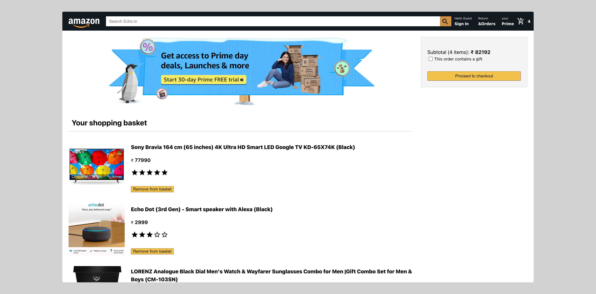
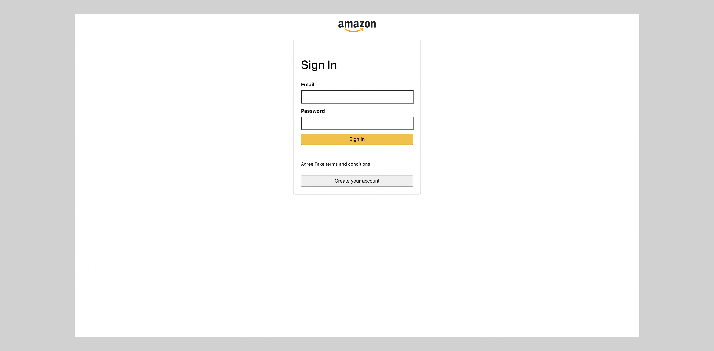

# Echo - The Amazon Clone 

## Getting Started
The "Svelte Amazon Clone" repository is for learning Svelte, a modern JavaScript framework for building user interfaces. By creating an Amazon clone, this project provided me a hands-on learning experience that combines the power of Svelte with the familiarity of a widely recognized e-commerce platform.
Hosted at Github Pages [here](https://echo-5whz65c5a-shreyans13.vercel.app/).

### Show some :heart: and :star: the repo to support the project. 

## Screenshots


### Desktop
 
 


## 👍 Contribution
1. Fork it
2. Create your feature branch (git checkout -b my-new-feature)
3. Commit your changes (git commit -m 'Add some feature')
4. Push to the branch (git push origin my-new-feature)
5. Create new Pull Request

### What can you contribute
1. Create a api for this application using ExpressJS or Django or any other framework
2. Find bugs or errors and fix it.
3. Improve UI/UX designs.
4. Add some cool features.

## Project setup
```
yarn install
```

### Compiles and hot-reloads for development
```
yarn start
```

### Compiles and minifies for production
```
yarn build
```


### Implementation :innocent:

This project is implemented in Svelte with Typescript and Firebase.


## Facing Any Problem or need any Help:grey_question:
Incase you face any problem or need any help write me in [issues](https://github.com/Shreyans13/Echo/issues) section. 


